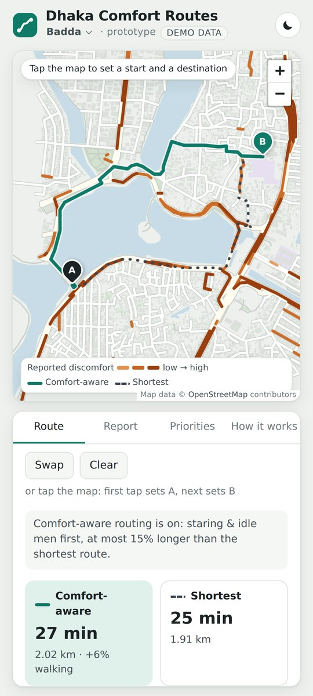

# Dhaka Comfort Routes

**Live demo: https://tanjilaafsarirubina.github.io/dhaka-comfort-routes/** (works best on a phone)

A prototype walking router for Dhaka. It steers pedestrians around streets that other people reported as uncomfortable, and it keeps the people who report anonymous. It is part of our undergraduate thesis at BRAC University, *A Privacy-Preserving Crowdsensing Framework for Subjective Urban Safety and Navigation in Dhaka*.

## What you can try

- **Route:** pick a start and a destination. The app shows the comfort-aware route (solid) beside the shortest route (dotted), with walking times and the flagged streets it avoids.
- **Report:** tap a street, tag what felt wrong (for example poor lighting, staring or men idling at corners) and send an anonymous report. Each phone gets ten report tokens a day.
- **Priorities:** choose one of two presets drawn from our survey of 702 Dhaka pedestrians, or set your own weights, the detour limit (15% by default) and whether comfort routing applies always or only after dark.
- **How it works:** the privacy design in plain language, with a live test of what one phone, or five phones, can do to the map.
- **Areas:** Badda, Dhanmondi, Gulshan–Banani, Mirpur and Mohammadpur. Switch areas from the header.

## Demo data

The street maps are real OpenStreetMap data from September 2026. The reports are **simulated** from map features, so the flagged streets do not describe how any real street feels.

In this demo the token issuer and the report server run inside the page, so nothing you enter is sent anywhere. Only your route preferences are saved, in your own browser.

## How it works

- **Anonymous but limited reports.** Tokens are signed with RSA blind signatures, at most ten per phone per day. The server can check a token but cannot tell which phone it came from.
- **A private map.** Once a week the server publishes noisy statistics for every street (differential privacy, ε = 3 per report) and deletes the raw reports. Reports on one street within the same half-hour count once.
- **Comfort-aware routing.** A penalty search over Dijkstra's algorithm avoids reported discomfort but never goes beyond the detour limit.

## Team

Sandip Kumar Paul and Tanjila Afsari Rubina, Department of Computer Science and Engineering, BRAC University, Dhaka.
Supervisor: Marshia Nujhat. Co-supervisor: Dr. Farida Chowdhury.

## Credits and licences

Map data © [OpenStreetMap contributors](https://www.openstreetmap.org/copyright), available under the Open Database License (ODbL 1.0). The area files in `areas/` and the map built into `index.html` are derived from it and are shared under the same licence. The map is drawn with [Leaflet](https://leafletjs.com/) (BSD-2-Clause).

## Copyright
© 2026 Sandip Kumar Paul and Tanjila Afsari Rubina. All rights reserved. The app's code and text may not be reused without our permission. Leaflet and the OpenStreetMap-derived map data keep their own licences.
